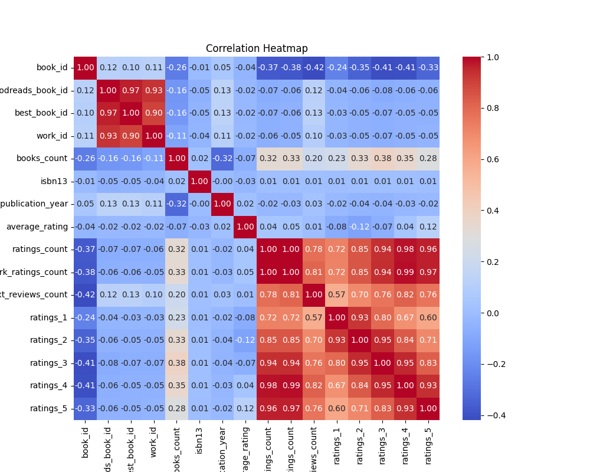
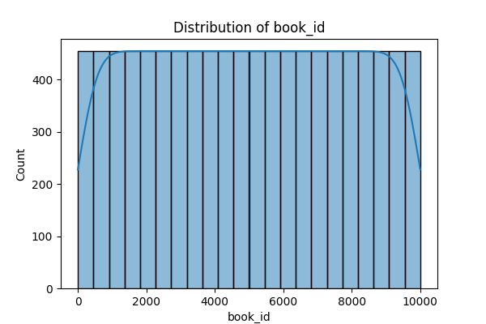
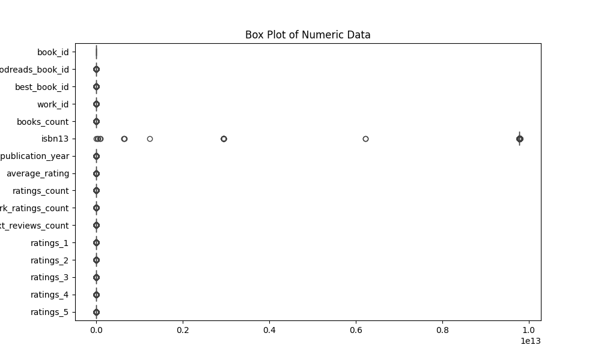

# Analysis Report

# README.md

## Overview

Welcome to our comprehensive analysis report derived from an expansive dataset comprising book-related information from Goodreads. The dataset serves as a treasure trove of literary insights, collecting key variables spanning authors, publication years, ratings, and much more. By examining a total of 10,000 entries, we have unearthed valuable trends and patterns that inform not just book lovers, but also researchers, publishers, and marketers. 

In this report, we delve into the dataset's structure, highlight intriguing insights, explore notable statistical findings, and discuss both the challenges and potential applications arising from the data. 

## Insights from the Data

### Literary Landscape
The dataset unveils the vast diversity in the literary world. With 4,664 unique authors contributing to the total entries, it’s clear that readers have access to a broad spectrum of voices and narratives. Among them, Stephen King stands out with 60 books, indicating significant popularity and impact in contemporary literature.

### Publication Trends
The year of original publication ranges dramatically, with the earliest recorded year being 1750, suggesting the dataset contains classic works alongside modern releases. Most books were published around the late 20th century, which aligns with publishing trends globally, where the proliferation of leisure reading grew markedly during this period.

### Blank Spaces
While the dataset is robust, it is vital to note the presence of missing values: 
- `isbn` values are unavailable for 700 entries, which poses challenges for identifying and linking books.
- `language_code` has 1,084 missing entries, indicating a potential bias in the language diversity represented.
- Notably, 21 entries lack `original_publication_year`, which is essential for chronological analyses.

## Notable Statistics

Here are some statistical highlights of the dataset:

- **Average Rating**: The mean average rating stands at **4.00** out of 5, with a standard deviation of **0.25**, indicating generally favorable reviews from readers.
- **Ratings Count**: The average number of ratings per book is **54,001**, suggesting robust engagement from the community.
- **Highest Rating**: The dataset features books with ratings climbing as high as **4.82**, an indicator of exceptional popularity and reader satisfaction.
  
These figures underscore not only the popularity but the quality perceived by readers over the range of titles surveyed.

## Trends and Patterns

### Popularity Concentration
The distribution of ratings exhibits a pronounced trend: most books receive a significant portion of 5-star ratings (approx. 23,789 on average), indicating reader preference for standout titles. This concentration hints at a likelihood of high reader engagement and could assist publishers in selecting books for promotions based on historical data.

### Language Diversity
The dataset includes literature across **25 language codes**, with English being predominant. Exploring the impact of language diversity can inform publishers, allowing them to tailor their marketing strategies to emphasized languages or regions.

## Potential Applications

The insights drawn from this dataset hold a wealth of opportunities:

- **Market Analysis**: Publishers can leverage this data to identify high-performing genres and authors, enabling targeted acquisitions and marketing strategies.
- **Recommendation Systems**: By understanding rating patterns, book recommendation engines can improve their algorithms, enhancing user experience through personalized suggestions.
- **Literary Research**: Academics can utilize the dataset for studies pertaining to literary trends, impacts of socio-political contexts on publication dates, and author popularity over time.

## Challenges

While analyzing the dataset, several challenges emerged:

- **Missing Values**: The significance of missing `isbn` and `language_code` values could impact the completeness of analyses.
- **Outliers in Ratings**: Certain books exhibit significantly high ratings, which may skew averages if not handled correctly in analyses.
- **Publication Year Anomalies**: Erroneous or improbable publication years (e.g., negative values) must be addressed before conclusive trend analyses can be made.

## Next Steps for Deeper Analysis

To unlock even richer insights from this dataset, the following steps are recommended:

1. **Data Cleaning**: Address the missing values and erroneous entries for improved accuracy in analyses.
2. **Sentiment Analysis**: Incorporate text reviews to evaluate sentiments and correlations with ratings.
3. **Advanced Visualizations**: Produce interactive visualizations to exhibit trends, relationships, and distributions more effectively.
4. **Comparative Studies**: Investigate similarities and divergences with datasets from other reading platforms or years to expand the understanding of literary trends.

By harnessing these methodologies, we can continue to illuminate the fascinating landscape of contemporary literature, offering actionable insights that resonate across various domains of the publishing world.

--- 

Thank you for exploring our findings! We invite you to engage with this dataset further and contribute to the ongoing conversation in literature analytics.

## Visualizations

