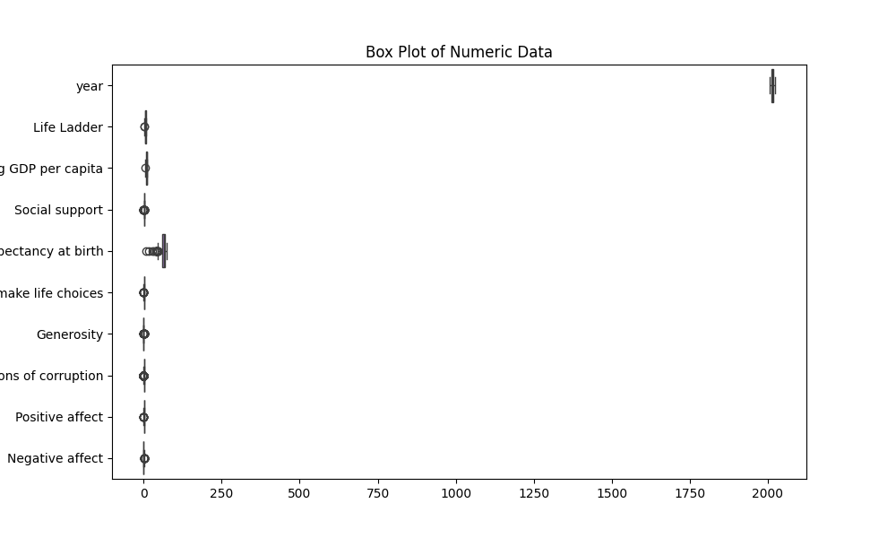

# Analysis Report

# README.md

## Overview

Welcome to the comprehensive analysis report of the happiness and well-being dataset! This dataset provides insightful metrics from various countries, focusing on how different factors contribute to individual happiness, or "Life Ladder," over the years. It encompasses diverse indicators such as GDP per capita, social support, healthy life expectancy, and people's perception of corruption, thus representing a multifaceted view of societal wellness. This report aims to elucidate key insights, uncover trends and patterns, and highlight statistics pivotal for understanding global happiness levels.

---

## Dataset Information

The dataset features the following columns, each designed to capture unique dimensions affecting happiness:

- **Country name** (object): The name of the country.
- **Year** (int64): Indicates the year of observation.
- **Life Ladder** (float64): A metric that assesses overall life satisfaction.
- **Log GDP per capita** (float64): The natural logarithm of the GDP per capita, indicating economic prosperity.
- **Social support** (float64): A measure of how individuals perceive the support they receive from friends, family, and the community.
- **Healthy life expectancy at birth** (float64): A statistical measure suggesting the expected number of years a person will live in good health.
- **Freedom to make life choices** (float64): A representation of how unrestricted individuals feel in making personal life decisions.
- **Generosity** (float64): This metric evaluates the extent of charitable giving in each country.
- **Perceptions of corruption** (float64): Indicates how citizens perceive corruption in their government and businesses.
- **Positive affect** (float64): A measure reflecting positive emotions experienced by individuals.
- **Negative affect** (float64): Captures negative emotions experienced by individuals.

---

## Insights from the Data

The dataset contains a total of **2363 observations**, covering a range of **165 unique countries**. 

### Notable Statistics & Findings

- **Life Ladder:** The average happiness score across all observations is approximately **5.48**, indicating a moderate overall life satisfaction. The scores range from **1.28** (the lowest) to **8.02** (the highest).
  
- **Log GDP per capita:** The data shows a mean value of **9.4**, with values fluctuating between **5.53** and **11.68**, which suggests a considerable difference in economic well-being across countries.

- **Social Support:** The average score stands at **0.81**, indicating that, generally, individuals feel adequately supported. However, the minimum score of **0.23** highlights disparities in social support across different nations.

- **Freedom to Make Life Choices:** With an average of **0.75**, this metric suggests that many individuals feel empowered in their personal decisions, although scores can dip as low as **0.23**.

### Missing Data Consideration

While valuable, the dataset does suffer from missing values across several columns:
- **Log GDP per capita** has **28** missing values.
- **Healthy life expectancy at birth** has **63** missing values.

These missing values must be addressed to avoid biased analyses moving forward.

---

## Trends and Patterns

### Visualizations

To better illustrate insights, visualizations were created, including:

1. **Correlation Heatmap**: Reveals relationships between variables, showing how economic factors, social support, and perceptions of corruption correlate with life satisfaction.

2. **Distribution by Year**: Analyzes trends over time, indicating if life satisfaction has generally improved or declined in various countries.

3. **Boxplot of Numeric Data**: Offers an overview of the spread and central tendency of key numerical variables.

These visualizations help us understand the complexity of happiness metrics and their interconnectedness.

---

## Potential Applications

The insights derived from this dataset can be applied in numerous sectors, such as:

1. **Policy Making**: Governments can tailor policies targeting social support and economic growth to enhance citizens' happiness.
  
2. **Sociological Research**: Researchers can delve deeper into the facets of happiness to establish a clearer understanding of what drives well-being in diverse populations.

3. **NGO Initiatives**: Non-governmental organizations can leverage this data to identify regions needing urgent support, particularly where corruption perception is high or social support is low.

---

## Challenges

1. **Data Completeness**: The presence of missing values may limit the robustness of conclusions drawn from the dataset. Careful methodologies in handling these gaps are essential.

2. **Cultural Differences**: Happiness is a subjective measure influenced by cultural contexts; therefore, comparisons across nations may require careful interpretation.

3. **Temporal Changes**: The socio-economic landscapes are dynamic; acknowledging external factors that can affect life satisfaction over years is crucial in any longitudinal study.

---

## Next Steps for Deeper Analysis

To enhance our understanding of the intricate relationship between the factors impacting happiness, consider the following approaches:

1. **Data Imputation**: Implement strategies to address missing values, either through imputation techniques or thorough exploration of why gaps exist.

2. **Time Series Analysis**: Conduct detailed longitudinal studies to track how happiness metrics evolve over time, possibly correlating with global events.

3. **Deeper Correlation Studies**: Explore more sophisticated regression models to ascertain the precise influence of various factors on life satisfaction, dissecting the complex interactions at play.

4. **Extended Dataset Inclusion**: Supplement current data with additional sources, such as surveys on mental health or economic changes, for more comprehensive insights.

In conclusion, this dataset offers a rich tapestry to explore the nuances of happiness across different countries and can inspire strategic initiatives to enhance individual well-being globally. Thank you for exploring this dataset, and let�s deepen our analysis together!

## Visualizations

