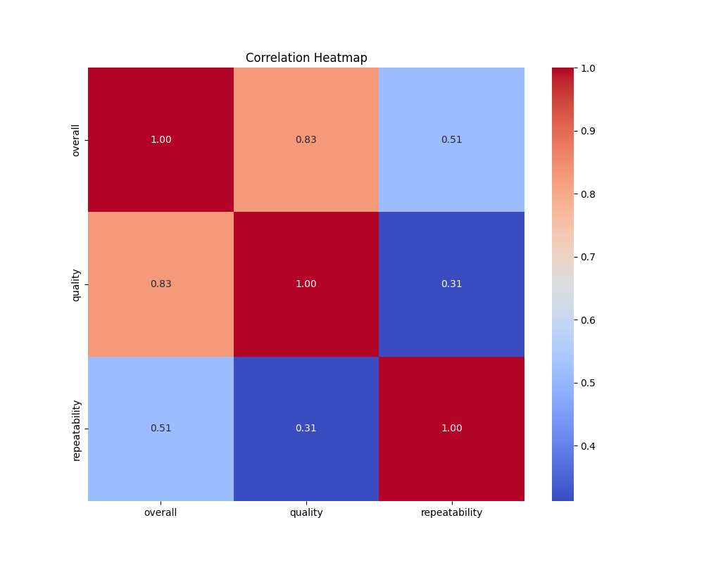
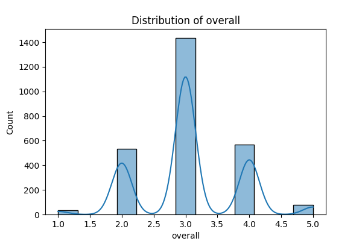
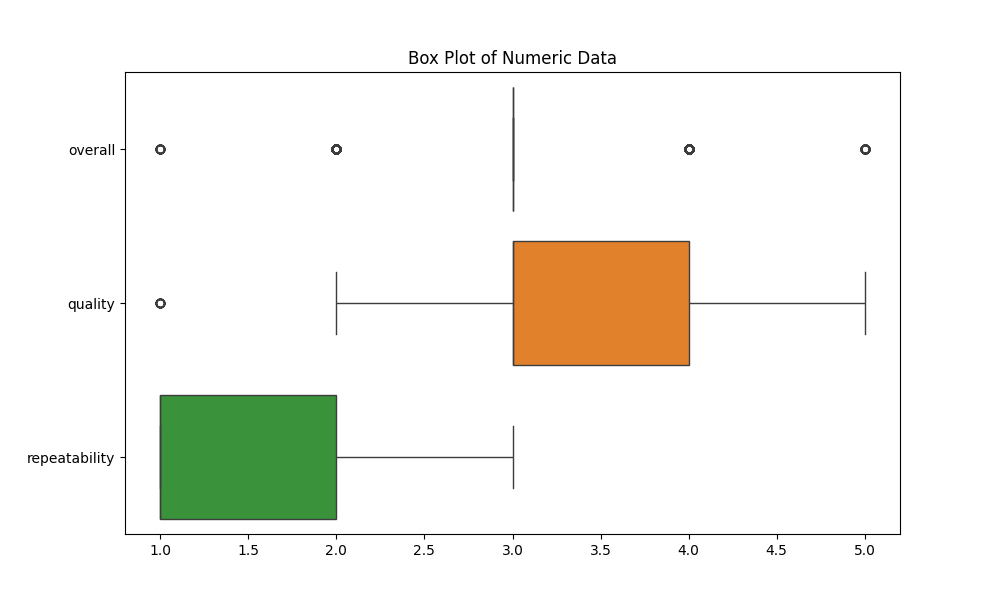

# Analysis Report

# Analysis Report: Entertainment Dataset Insights

## Overview
This document presents a comprehensive analysis of a dataset containing 2,652 entries related to various entertainment titles including movies and TV shows. The dataset encompasses key attributes such as language, type, creators, and ratings, encapsulated in the following columns: `date`, `language`, `type`, `title`, `by`, `overall`, `quality`, and `repeatability`. The objective of this analysis is to uncover meaningful insights from the data, discern trends or patterns, identify notable statistics, explore potential applications, and discuss challenges faced during the analysis process.

## Insights from the Data
The dataset showcases a diverse array of entertainment products with varying levels of quality and overall appeal. The primary insights derived from the dataset include:

1. **Product Diversity**: The dataset consists of 11 unique languages and 8 types (with movies being the most represented). The dominant language is English, contributing to 49% of the total entries.

2. **Quality Ratings**: The average quality rating across all entries is approximately 3.21 (on a 1 to 5 scale), indicating a generally favorable view among viewers. Notably, the standard deviation of ratings (0.8) suggests a moderately diverse quality perception.

3. **Repeatability**: Most content receives a repeatability score of 1, suggesting that many titles are not intended for repeated viewing or don’t succeed in engaging viewers beyond the initial experience.

## Trends or Patterns
Several intriguing trends and patterns emerge from the data:

- **Temporal Engagement**: The dataset spans a significant timeline with 2,553 unique dates. The oldest title on record is dated on 21-May-2006, possibly indicating growth in content production over time. The concentration of releases may suggest seasonal behavior in entertainment consumption.

- **Correlations**: Initial correlation visualizations (refer to `correlation_heatmap.png`) indicate a moderate correlation between overall ratings and quality ratings. Higher quality often translates into better overall ratings, highlighting the importance of production quality.

## Notable Statistics
Key statistics from the dataset include:

- **Frequent Contributors**: Kiefer Sutherland appears to be the most frequent creator in the dataset with 48 entries. This lends credence to the notion of certain individuals consistently shaping the landscape of entertainment.
  
- **Distribution of Overall Ratings**: The distribution analysis (see `distribution_overall.png`) reveals a peak around the 3-star rating, indicating raised expectations but perhaps a lack of standout titles.

- **Boxplot Insights**: Boxplot visualizations (available in `boxplot_numeric_data.png`) illustrate the interquartile ranges of quality, reveal potential outliers, and hint at skewed perceptions within the dataset.

## Potential Applications
The insights uncovered from this dataset can be leveraged in multiple contexts:

- **Content Recommendation Systems**: By analyzing ratings and repeatability scores, businesses can personalize recommendations, thus enhancing user experience in streaming platforms.

- **Market Analysis**: Media companies can evaluate trends in language and content type preferences to make informed decisions on future productions, particularly in underrepresented categories.

- **Quality Assessment**: Leveraging insights on quality ratings can guide creators and producers in understanding viewer expectations and improving future productions.

## Challenges
Challenges encountered during the analysis include:

- **Missing Values**: The dataset exhibits some missing values, particularly in the `date` and `by` columns. The presence of these missing entries poses challenges in ensuring a comprehensive analysis.

- **Subjectivity in Ratings**: Ratings can be highly subjective; ensuring consistency in evaluations across different viewers and cultural contexts is key to deepening the analysis.

- **Temporal Dynamics**: With the `date` column spanning a wide time frame, understanding shifts in consumer preferences over time could complicate straightforward analyses.

## Next Steps for Deeper Analysis
To extend the insights from this dataset, the following steps are recommended:

1. **Data Cleaning**: Address missing values through imputation or removal strategies to enhance data integrity.

2. **Temporal Analysis**: Implement a more robust temporal analysis to track how preferences and ratings change over time. 

3. **Sentiment Analysis**: Incorporate qualitative data, such as reviews or comments, if available, to add depth to the understanding of viewer perceptions.

4. **Machine Learning Applications**: Explore predictive modeling techniques to forecast ratings based on various factors like type, language, or creator.

5. **Benchmarking**: Compare this dataset with others within the entertainment sector to develop a more comprehensive understanding of trends across multiple datasets.

By pursuing these avenues, further insights can be drawn to better understand audience preferences and inform strategic decisions in the entertainment industry.

## Visualizations

